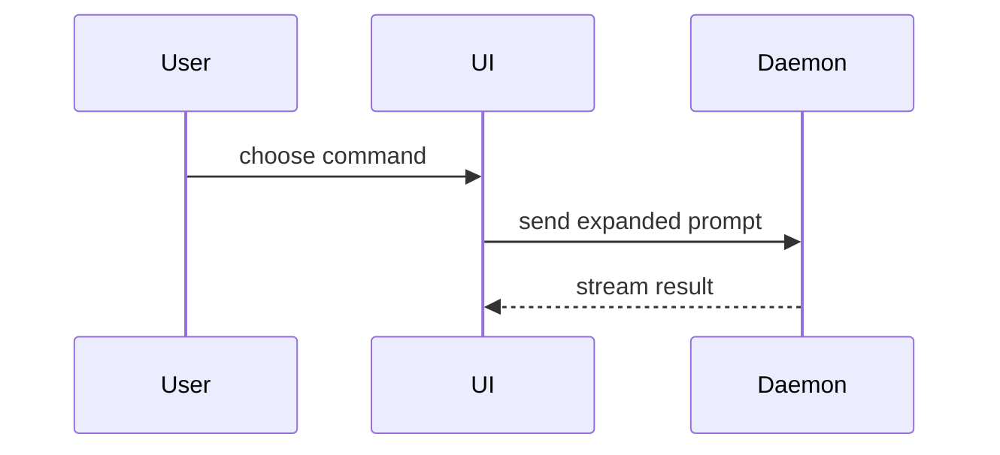

# Show Me

用可视化帮用户理解当前对话话题。跳过铺垫，文字极简，选**能说清关键点的最小视图**。

- 逻辑或算法用伪代码：

```text
on(save)
  if content is unchanged
    return cached result
  write new content
  return fresh result
```

- 运行时控制流用调用树：

```text
submitForm
  createSession
    persistPrompt
    launchAgent
  navigateToSession
```

- UI 结构用组件树（标注值得注意的状态与模块边界）：

```tsx
<SessionPage> (apps/example/src/routes/session.tsx)
  useSessionEvents()
  <SessionToolbar>
    <RunSkillButton> (packages/ui)
```

- 文件职责或宏观重构用浅层文件树：

```text
src/
├── commands/       # 解析用户操作
├── sessions/       # 持有会话状态
└── transport/      # 发送 API 请求
```

- 组件交互、控制流、数据流用 Mermaid：



- 要点在"改了什么"且周围结构已存在时，用 `diff`，diff 形态贴合话题：

```diff
 <SessionPage>
   useSessionEvents()
   <SessionToolbar>
+    <RunSkillButton />
   <SessionTimeline>
+    <SkillResultCard />
```

形态选择速查：讲算法 → 伪代码；讲执行路径 → 调用树；讲结构归属 → 文件树/组件树；讲时序交互 → Mermaid 时序图；讲变更 → diff。一次只画一种，画对目标再说事。
